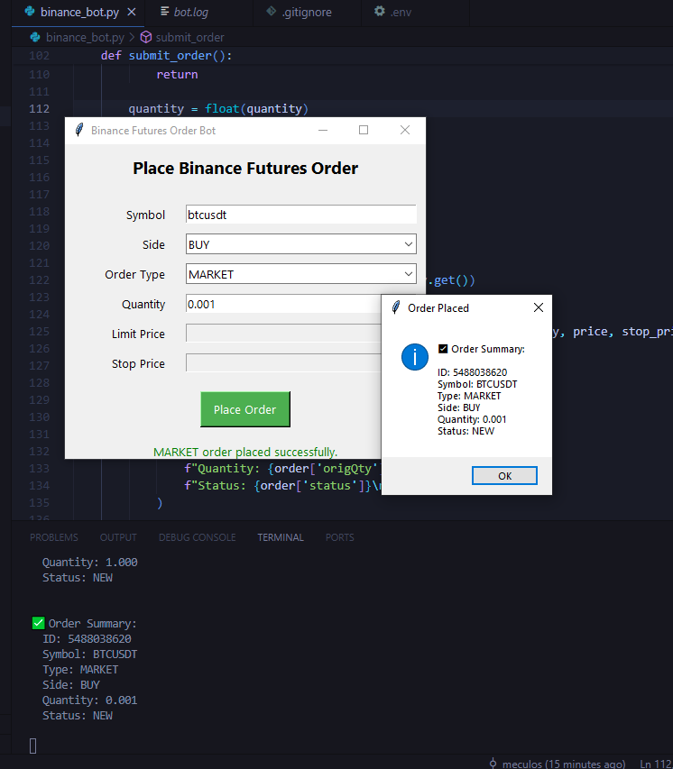

# Binance Trading Bot with GUI & Telegram Integration

This is a Python-based trading bot that allows users to place **Market**, **Limit**, and **Stop-Limit** orders directly from a user-friendly **Tkinter GUI**. It also logs activity and provides feedback through a **Telegram bot** for real-time updates.

## Features

-  Market, Limit, and Stop-Limit order execution
-  Clean, interactive Tkinter GUI
-  Logging to `bot.log` for all actions
-  Secure handling of API keys
-  Order summary displayed on both GUI and terminal

## 🖼️ GUI Preview

 

## Setup Instructions

### 1. Clone the Repository
```bash
git clone https://github.com/Meculos/binance-bot.git
cd binance-bot
```

### 2. Install Dependencies
```bash
pip install -r requirements.txt
```

### 3. Configure Environment Variables
Create a .env file in the root directory with your Binance credentials:
```env
API_Key=your_api_key
API_Secret=your_secret_key
```

### 4. Run the binance_bot.py file

### Project Structure
```bash
├── binance_bot.py                
├── .gitignore                
├── .env                  
├── requirements.txt
└── bot.log               
├── README.md
└── image/
    └── binance_img.png
```

### Example Order Summary
```yaml
 Order Summary:
  ID: 123456789
  Symbol: BTCUSDT
  Type: LIMIT
  Side: BUY
  Quantity: 0.001
  Price: 30000.0
  Stop Price: None
  Status: NEW
```
### Future Improvements
Add order cancellation support

Track open orders in the GUI

Add historical trade viewer
